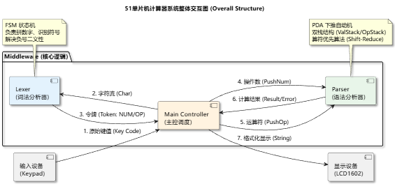
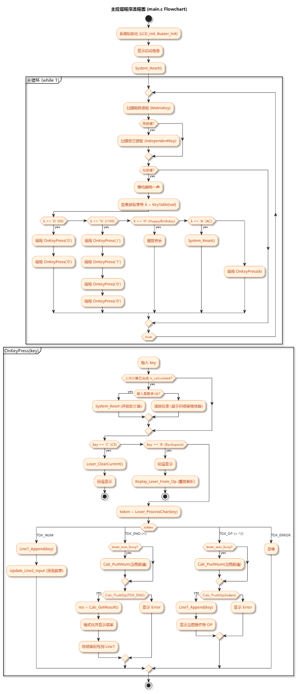
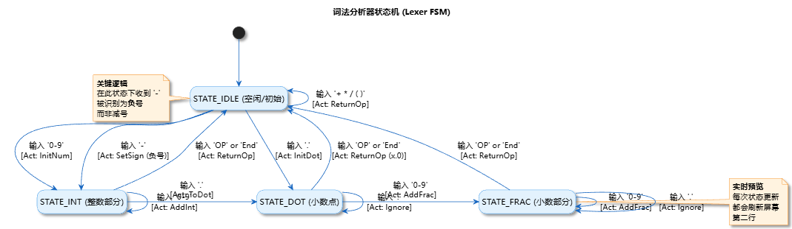
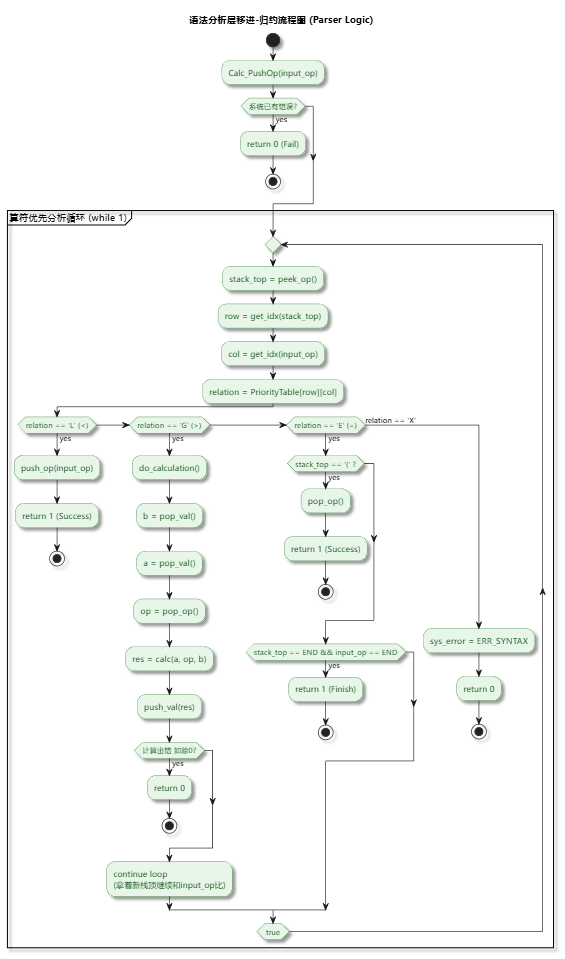

# 51单片机流式混合运算计算器 (Stream-Based Calculator)

这是一个基于 **STC89C516** 单片机的高性能计算器开源项目。

不同于传统的简易计算器，本项目引入了**编译原理**中的核心算法，在资源受限的 51 单片机上实现了**带括号的浮点数四则混合运算**。系统采用 **流式状态机 (FSM)** 进行词法分析，并使用 **算符优先分析法 (Operator-Precedence Parsing)** 进行语法归约，彻底解决了负号二义性与运算优先级问题。

---

## 🛠️ 硬件与开发环境 (Hardware & Environment)

本项目专为 **普中51-单核-A5** 开发板适配，具体配置如下：

### 1. 硬件配置

- **开发板型号**: 普中51-单核-A5 (PZ51-Single-A5)
- **主控芯片**: **STC89C516** (兼容 STC89C52/54/58 系列)
- **显示模组**: LCD1602 液晶屏
- **输入模组**:
  - **矩阵按键**: 接 **P1** 口 (JP3)
  - **独立按键**: 接 **P3** 口 (JP1)
- **音频模组**: 无源蜂鸣器，接 **P2.4** (JP7)

### 2. 软件环境

- **代码编辑**: VSCode
- **编译工具**: Keil uVision 5 (C51)
- **烧录工具**: AiCube-ISP

---

## 📂 项目结构说明 (File Structure)

项目核心代码分为中间件层与驱动层，架构清晰，耦合度低。

### 1. Middleware (核心算法层)

- **`Lexer.c/h`**: **词法分析器**。实现流式有限状态机 (FSM)，实时解析按键流，识别数字、小数点及负号逻辑。
- **`Parser.c/h`**: **语法分析器**。实现下推自动机 (PDA)，基于双栈处理括号优先级与四则运算归约。
- **`Double2Str.c/h`**: **显示优化**。专为 LCD1602 优化的浮点转字符串算法，包含自动去除尾零逻辑。

### 2. Drivers (硬件驱动层)

- **`LCD1602.c/h`**: 屏幕驱动，负责光标控制与字符显示。
- **`MatrixKey.c/h`**: 矩阵键盘驱动 (P1口)，包含消抖与松手检测。
- **`IndependentKey.c/h`**: 独立按键驱动 (P3口)。
- **`Buzzer.c/h`**: 蜂鸣器驱动 (P2.4)，提供按键音反馈。

---

## 🚀 编译与运行 (Compile & Run)

请严格按照以下步骤操作，以确保程序正常运行：

1. **打开工程**：

    启动 Keil uVision 5，点击菜单栏 `Project -> Open Project...`，选择项目根目录下的 `MyCalculator.uvproj` 文件。

2. **编译代码**：

    点击工具栏上的 **Rebuild** 按钮（或按 `F7`）。
    * 观察下方 "Build Output" 窗口，必须显示 `0 Error(s), 0 Warning(s)`。
    * 成功后，会在 `Objects/` 目录下生成 `MyCalculator.hex` 文件。

3. **烧录固件**：

    打开 **AiCube-ISP** 烧录软件：
    * **芯片型号**：选择 `STC89C516`。
    * **串口号**：选择开发板对应的 COM 口（如 CH340）。
    * **打开文件**：加载刚才生成的 `Objects/MyCalculator.hex`。
    * 点击 **程序下载** 按钮。
    * **冷启动**：此时按下开发板上的电源开关（先断电再通电），进度条走完即烧录成功。

---

## 📖 使用手册 (User Manual)

### 键盘映射表

| 7 | 8 | 9 | / |
|---|---|---|---|
| 4 | 5 | 6 | * |
| 1 | 2 | 3 | - |
| **D** | 0 | . | + |
| ( | ) | % | = |
| **A** | **C** | **H** | **B** |

### 功能键说明

- **D (00)**: 快速输入双零，提升大数输入效率。
- **%**: 百分号功能，将前一个数除以 100 参与运算。
- **A (AC)**: 全局重置，清空所有状态。
- **C (CE)**: 清除当前输入，仅清空当前正在拼写的数字，保留之前的运算符。
- **B (BS)**: 退格，删除当前数字的最后一位。
- **H (Happy Birthday)**: 播放内置彩蛋生日快乐歌。（其实是因为课程练习做了，懒得重构蜂鸣器代码）

---

## 🏗️ 系统架构设计 (System Architecture)

本项目采用分层设计，以下是系统的核心架构图解。

### 1. 整体交互架构

系统数据流向：`Keypad -> Main -> Lexer -> Parser -> LCD1602`。

### 2. 主控调度逻辑 (Main)

主循环负责扫描按键、分发事件以及协调 Lexer 和 Parser 的工作。

### 3. 词法分析器 (Lexer FSM)

基于状态机的 Token 识别过程。

### 4. 语法分析器 (Parser PDA)

基于双栈的算符优先计算过程。

---

## 🧠 核心算法详解 (Core Algorithms)

### 1. 词法分析：流式有限状态机 (FSM Table)

为了在单片机上处理连续的按键流，`Lexer` 模块维护了一个状态跳转表。该表决定了系统如何根据**当前状态**和**输入事件**来迁移状态并执行动作（如拼凑数字或识别算符）。

| 当前状态 (State) | 事件 (Event) | 下个状态 (Next) | 动作 (Action) | 说明 |
| :--- | :--- | :--- | :--- | :--- |
| **IDLE** (空闲) | 数字 `0-9` | **INT** | `InitNum` | 开始拼凑新数字 |
| | 小数点 `.` | **DOT** | `InitDot` | 开始拼凑小数 `0.` |
| | 符号 `-` | **INT** | `SetSign` | **识别为负号** (非减号) |
| | 算符 `+*/` | **IDLE** | `ReturnOp` | 直接返回运算符 |
| **INT** (整数) | 数字 `0-9` | **INT** | `AddInt` | 累加整数位 |
| | 小数点 `.` | **DOT** | `ToDot` | 切换到小数模式 |
| | 算符 `+-*/` | **IDLE** | `ReturnOp` | 数字结束，返回算符 |
| **DOT** (小数点) | 数字 `0-9` | **FRAC** | `AddFrac` | 开始累加小数位 |
| | 小数点 `.` | **DOT** | `Ignore` | 忽略重复小数点 |
| | 算符 `+-*/` | **IDLE** | `ReturnOp` | 视为 `x.0` 处理 |
| **FRAC** (小数) | 数字 `0-9` | **FRAC** | `AddFrac` | 累加小数位 |
| | 算符 `+-*/` | **IDLE** | `ReturnOp` | 小数结束，返回算符 |

> **设计亮点**：通过 `IDLE` 态对 `-` 号的特殊处理（转入 `INT` 并标记符号位），从根本上消除了负号与减号的二义性。

### 2. 语法分析：算符优先表 (Operator Precedence Table)

`Parser` 根据栈顶算符与当前输入算符的优先级关系，决定是**移进 (Shift)** 还是 **规约 (Reduce)**。

**符号图例**：

* `⋗` (Greater): 栈顶优先级高 -> **规约 (Reduce)**
* `⋖` (Less): 栈顶优先级低 -> **移进 (Shift)**
* `≐` (Equal): 优先级相同 -> **消去 (Match)** (用于括号匹配)
* `Err`: 语法错误

| 栈顶 \ 输入 | `+ -` | `* /` | `(` | `)` | `=` |
| :---: | :---: | :---: | :---: | :---: | :---: |
| **`+ -`** | `⋗` | `⋖` | `⋖` | `⋗` | `⋗` |
| **`* /`** | `⋗` | `⋗` | `⋖` | `⋗` | `⋗` |
| **`(`** | `⋖` | `⋖` | `⋖` | `≐` | `Err` |
| **`)`** | `⋗` | `⋗` | `Err` | `⋗` | `⋗` |
| **`=`** | `⋖` | `⋖` | `⋖` | `Err` | `≐` |

> **解析逻辑**：
> * 当关系为 `⋖` 时：当前算符压入符号栈（优先级高，先待着）。
> * 当关系为 `⋗` 时：弹出栈顶符号进行计算（栈顶优先级高，先算栈里的）。
> * 当关系为 `≐` 时：通常用于脱去括号 `(` 和 `)`。

---

## 📄 开源许可 (License)

本项目采用 **MIT License** 开源。